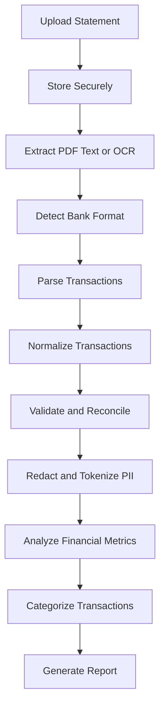
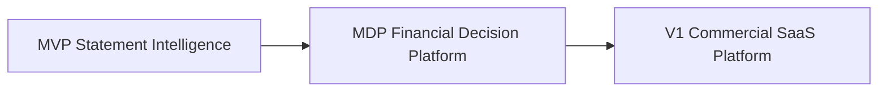

# Mermaid Diagrams

## Processing Pipeline

```mermaid
flowchart TD
    A[Upload Statement] --> B[Store Securely]
    B --> C[Extract PDF Text or OCR]
    C --> D[Detect Bank Format]
    D --> E[Parse Transactions]
    E --> F[Normalize Transactions]
    F --> G[Validate and Reconcile]
    G --> H[Redact and Tokenize PII]
    H --> I[Analyze Financial Metrics]
    I --> J[Categorize Transactions]
    J --> K[Generate Report]
```

## Portfolio Sequence

```mermaid
flowchart LR
    MVP[MVP Statement Intelligence] --> MDP[MDP Financial Decision Platform]
    MDP --> V1[V1 Commercial SaaS Platform]
```
