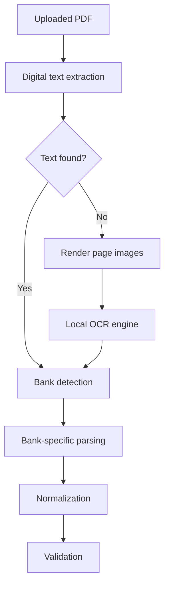

# PDF Extraction Future Considerations

## Purpose

This note captures the later-stage work for scanned PDF handling under the
`[MVP-E03] PDF Extraction` epic.

The current repo already covers deterministic digital PDF text extraction in
`packages/bank-statement-parser`. OCR and deeper statement detection are
deliberately deferred so the team can revisit them with a clearer runtime,
privacy, and fixture strategy.

## Current Boundary

- `packages/bank-statement-parser` should remain the owner of PDF parsing and
  bank-specific extraction.
- `apps/web` should stay thin and only call parser/package entrypoints.
- OCR, page rendering, and statement detection should be implemented behind
  package boundaries, not inside route handlers or React components.
- Raw statement bytes and extracted text must never leave the local processing
  path unless a future design explicitly approves that boundary.

## Suggested Future Architecture

Recommended package responsibilities for a later OCR stage:

- `packages/bank-statement-parser`
  - digital text extraction
  - page image extraction or rendering
  - OCR adapter orchestration
  - bank detection heuristics
  - bank-specific parsing
- `packages/statement-processing`
  - normalization
  - idempotency
  - state transitions
  - safe metadata shaping
- `apps/web`
  - upload orchestration only
  - no OCR or parsing logic

## Candidate Tools and Packages

Use only local or vendored tooling for OCR and rendering.

- `unpdf`
  - good fit for deterministic PDF text extraction
  - can also help with page/image handling
- `@napi-rs/canvas`
  - useful if PDF pages must be rendered to raster images locally
  - keep it isolated behind a parser adapter
- `tesseract.js`
  - viable if we vendor the required trained data and keep the OCR path local
  - should not rely on runtime network access
- `sharp`
  - useful for controlled image preprocessing if later tests need it
  - keep image transforms deterministic and well covered

Prefer the smallest dependency set that can reliably handle the target
statement formats. If a package introduces a native build step, document the
build approval and pin the exact runtime assumptions.

## Deferred Implementation Steps

1. Define a single parser-level contract for extracted text and page metadata.
2. Decide whether OCR should be page rendering plus OCR, or image extraction
   plus OCR, based on the statement formats we actually need to support.
3. Add a local OCR adapter that accepts image buffers and returns plain text
   only.
4. Add bank detection heuristics for the supported banks.
5. Add synthetic fixtures for:
   - text-native PDFs
   - image-only scanned PDFs
   - mixed-format statements
   - multi-page statements with wrapped descriptions
6. Wire the chosen detection result into `apps/web/actions/statement-upload.ts`
   only after the parser package is stable.
7. Keep normalized transactions and safe warnings as the only data passed
   across the app boundary.

## Privacy and Security Considerations

- Do not send raw statements to external OCR or AI services.
- Do not log raw text, account numbers, card numbers, or identity details.
- Treat OCR output as sensitive statement content until redacted or normalized.
- Vendor any required OCR language data locally if the implementation depends
  on it.
- Keep all sample PDFs synthetic or heavily redacted.

## Testing Considerations

- Use deterministic synthetic PDFs for both digital and scanned paths.
- Add parser tests for:
  - digital text extraction ordering
  - OCR fallback behavior
  - bank detection heuristics
  - wrapped transaction descriptions
- Prefer small, focused fixtures that encode layout edge cases without exposing
  real statements.
- Verify that OCR-specific logic does not change the existing deterministic
  digital extraction behavior.

## Suggested Definition of Done

- Text-native PDFs parse without OCR.
- Image-only PDFs can be processed locally without network calls.
- Bank detection is deterministic and covered by tests.
- The parser package exposes a clean, stable API for the app layer.
- The app layer only consumes sanitized results and warnings.
- The solution remains compatible with the repo's privacy and testability
  rules.
